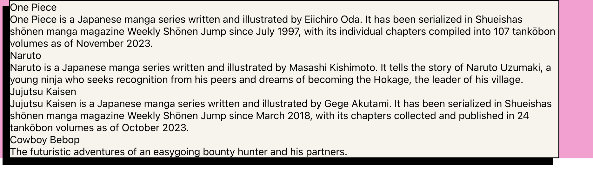

# Accelerator assessment

## Navigating a monorepo

This project is a monorepo, meaning that the frontend and backend are in the same repository. You have to `cd` into `/backend` or `/frontend` in order to `npm install` for both ends of the stack. They each have their own package.json and therefore their own dependencies. The frontend and backend will also need their own .env files. You will not be able to use `npm run start` or other scripts unless you are in the correct folder. `npm run start` will start the `frontend`.

## Backend

Copy the following into a .env file that you create in your /backend folder
`PORT=3001
PG_HOST=localhost
PG_USER='postgres'
PG_PORT=5432
PG_DATABASE='animes_dev'`

1. open a terminal and cd into backend
2. run the following commands
   1. `npm i`
   2. `npm run setup`
   3. `npm run start`
3. you should be able to open Postman see 'In Pursuit of Accelerator 2' when you make a GET request to [http://localhost:3001](http://localhost:3001)

### Backend assessment instructions

1. Navigate to `backend/controllers/animeController.js`
2. There should be comments saying what routes to write and what they should do
3. You can read the test files in backend/controllers/__test__ to get a better picture of how to implement the routes described in the instructions
4. You should be able to run `npm run test` and see all of the tests fail
5. The database has one table called `animes`. Each anime has an id, name, and description, all of which are required.
6. Queries that you can use are already imported in `animeController.js`. You can read backend/queries/`animes.js` to see their exact implementation. You are NOT expected to write your own queries for this exercise.
   1. `getAllAnimes`: returns an array containing all of the animes in the database
   2. `getOneAnime(animeId)`: returns an anime matching an id if it exists in the database, otherwise it returns null.
   3. `createOneAnime(name, description)`: adds a new anime to the database and returns the data for that new anime if the operation succeeded.
   4. `updateOneAnime(id, body)`: takes an id and a body object containing a name and description and updates the existing anime in the database with the matching id to have the newly provided data
   5. `deleteOneAnime(id)`: takes an id and deletes a record from the animes table matching that id

## Frontend

### Setup

1. `npm install`
2. `npm run start`
3. Do not change the structure of the HTML or any of the existing class names

### Instructions

1. In the use `Animes.js` file, fetch a list of all animes from your server
   1. You are allowed to use `axios` and `fetch`
2. render a list of animes in `Animes.js` using the Anime component
3. There should be at least 4 animes in your database to pass the tests
4. 
   1. Your animes should be laid out like this
